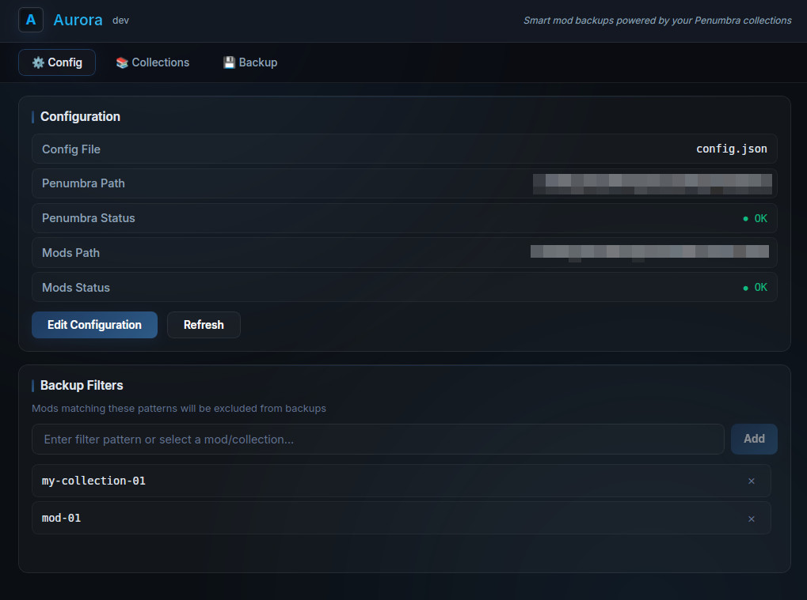
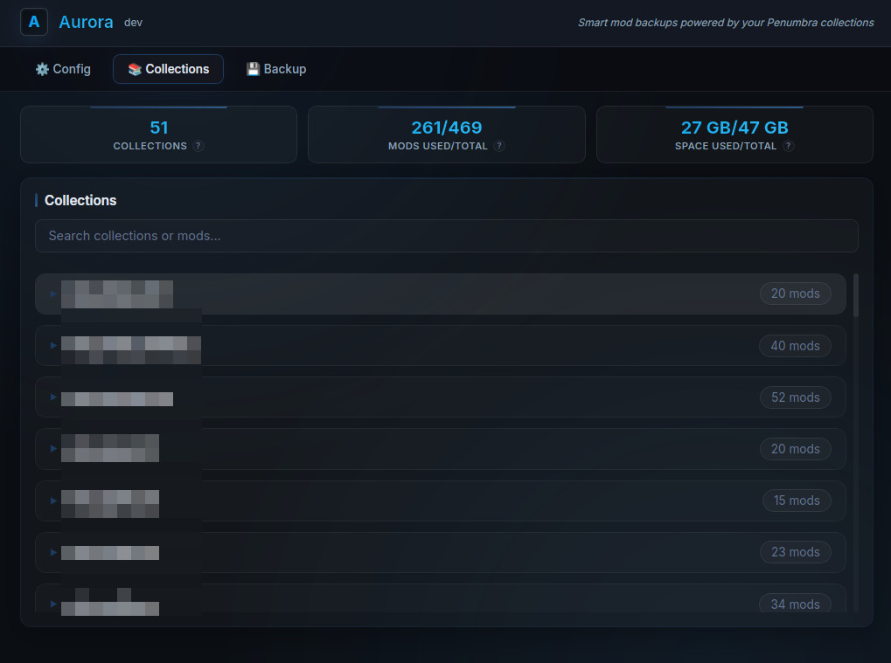
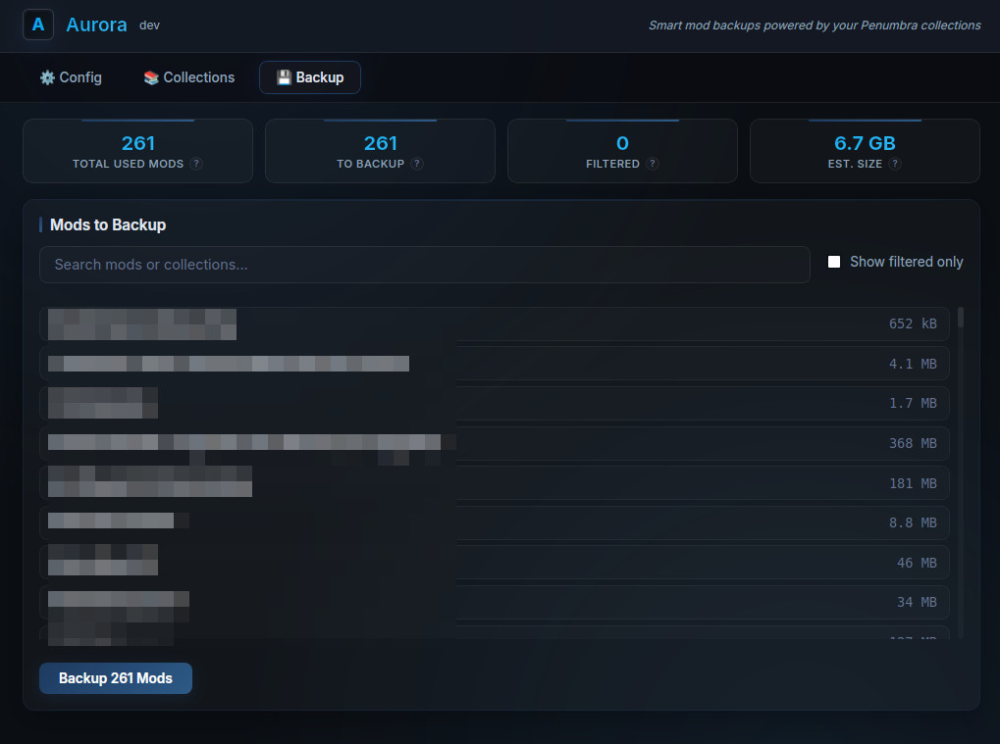

# Aurora

[](https://github.com/valanepsilon31/Aurora/releases)
[](https://github.com/valanepsilon31/Aurora/actions)
[](LICENSE)
[](https://ko-fi.com/valara9930)


Aurora is a simple backup tool for [Penumbra](https://github.com/xivdev/Penumbra) mods. It scans your collections, finds which mods you're actually using, and backs them up into a several zip files.

## Important Notes

**Aurora backs up your mod files, not your game data.** For mods configs like penumbra, glamourer etc but also real ingame stuff like hotbars, macros, use [JustBackup](https://github.com/NightmareXIV/JustBackup) instead.

> **Disclaimer:** I built this tool for myself but wanted to share it with the community. It's provided as-is - use at your own risk. I'm not responsible for any data loss or issues that may occur. Always keep your own backups!

> **macOS:** The macOS builds (both Desktop and CLI) have not been tested. They may or may not work - feedback welcome!

---

## How to Use

### 1. Configure Your Paths

Set your Penumbra config folder and mods folder. You can also add filters to exclude specific mods or collections from backups.



### 2. Browse Your Collections

See all your Penumbra collections at a glance. Check which mods are in use and how much space they take.



### 3. Create Your Backup

Preview what will be backed up, then hit the button. Aurora compresses only the mods you're actually using.



### 4. Watch the Progress

Sit back and relax while Aurora does its thing.


---

## Download

Grab the latest release for your platform from the [Releases](https://github.com/valanepsilon31/Aurora/releases) page:

| Platform | Desktop App | CLI Only |
|----------|-------------|----------|
| Windows | `aurora-desktop-windows-amd64.zip` | `aurora-windows-amd64.zip` |
| macOS (Apple Silicon) | `aurora-desktop-darwin-arm64.tar.gz` | `aurora-darwin-arm64.tar.gz` |
| macOS (Intel) | *not supported* | `aurora-darwin-amd64.tar.gz` |
| Linux | `aurora-desktop-linux-amd64.tar.gz` | `aurora-linux-amd64.tar.gz` |
| Linux | *not supported* | `aurora-linux-arm64.tar.gz` |
---

## CLI (Optional)

Prefer the command line? Aurora has you covered:

```bash
# Check your config
aurora config

# See your collections
aurora penumbra

# Preview backup
aurora backup --validate

# Faster with multiple threads
aurora backup --threads 4
```

---

## Troubleshooting

If something isn't working correctly, check the `aurora.log` file located next to the executable. It contains detailed information about what Aurora is doing and any errors that occur.

---

## License

MIT
